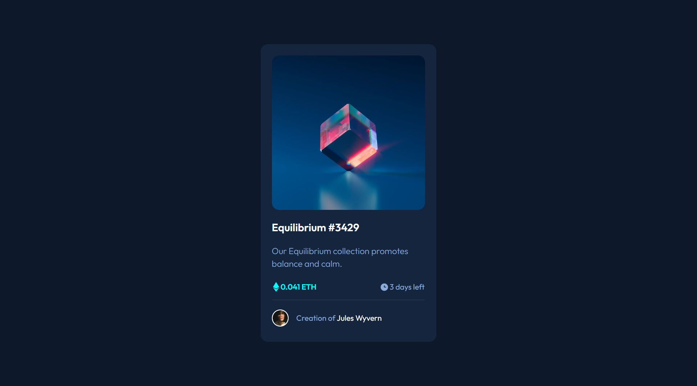

# NFT preview card component with React

## Table of contents

- [Overview](#overview)
  - [The challenge](#the-challenge)
  - [Screenshot](#screenshot)
  - [Links](#links)
- [My process](#my-process)
  - [Built with](#built-with)
  - [Continued development](#continued-development)
- [Author](#author)

## Overview

### The challenge

Users should be able to:

- View the optimal layout depending on their device's screen size
- See hover states for interactive elements

### Screenshot

### Links

- Solution URL: [GitHub repository](https://github.com/Luka-khokhashvili/nft-preview-card-component.git)
- Live Site URL: [GitHub page](https://your-live-site-url.com)

## My process

### Built with

- Semantic HTML5 markup
- CSS
- Flexbox
- CSS Grid
- Responsive design for tablet and mobile devices
- [React](https://reactjs.org/) - JS library

### Continued development

This project is my first work usings React framework. I am satisfied with the work process and the results.
I will definitely continue to work and build many projects using React framework.

## Author

- Portfolio - [Luka khokhashvili](https://luka-khokhashvili.github.io/Portfolio/)
- GitHub - [@luka-khokhashvili](https://github.com/Luka-khokhashvili)
- LinkedIn - [@luka-khokhashvili](https://www.linkedin.com/in/luka-khokhashvili-8179b7285/)
